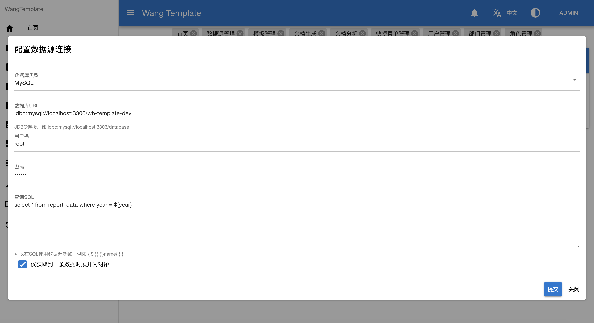
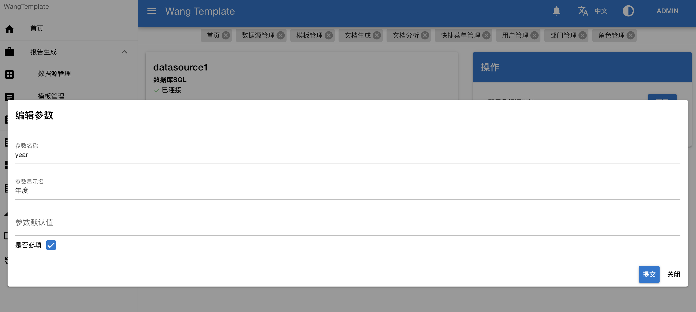
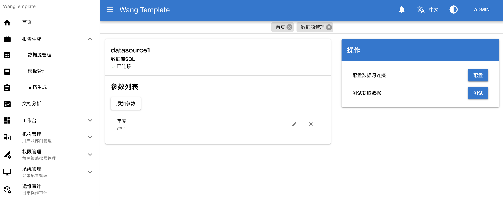
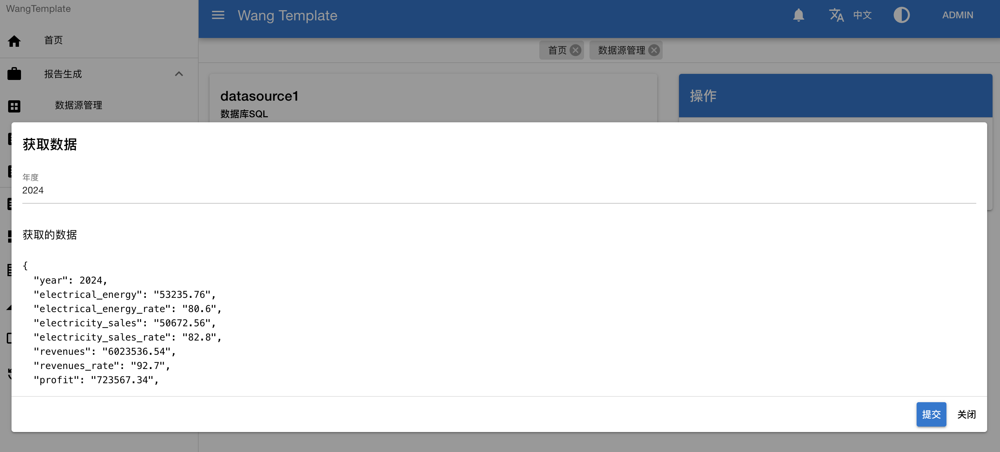
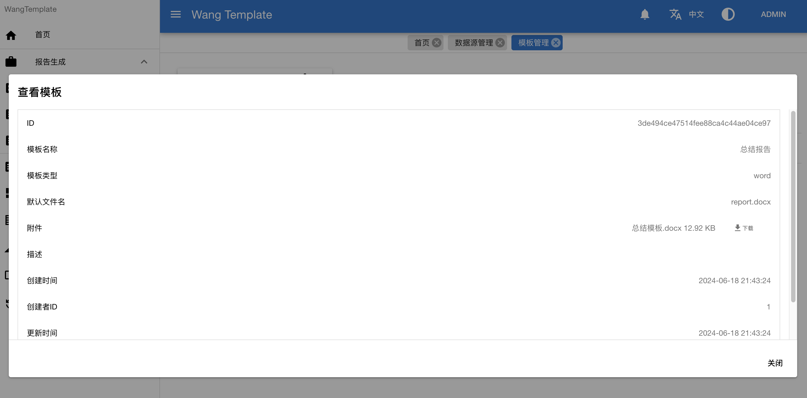
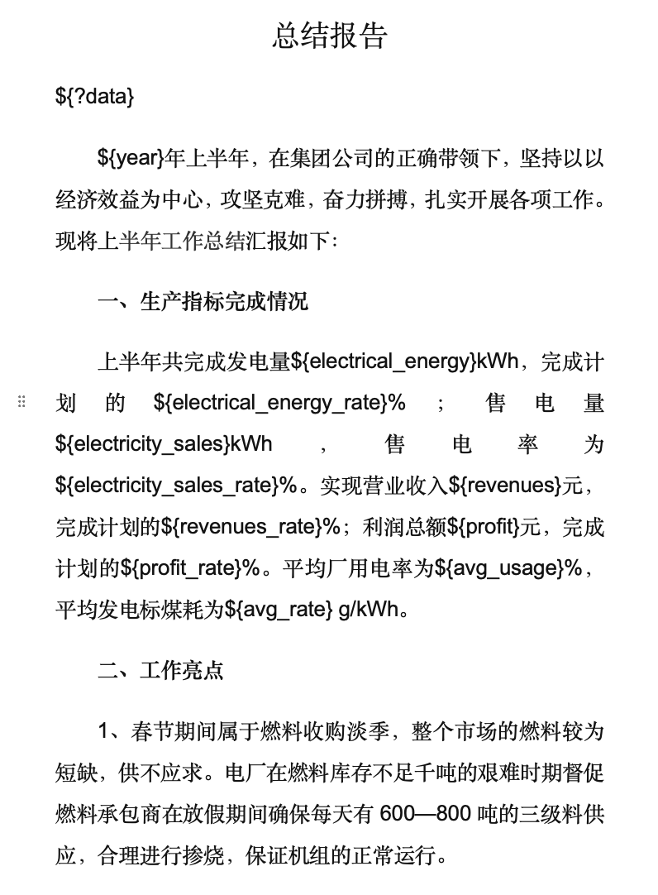
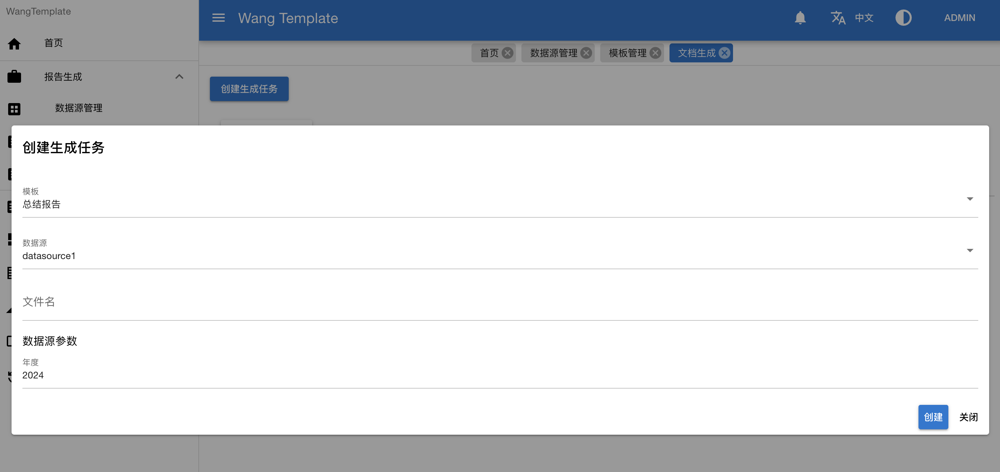
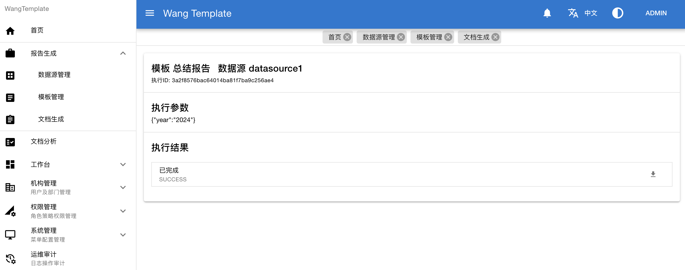
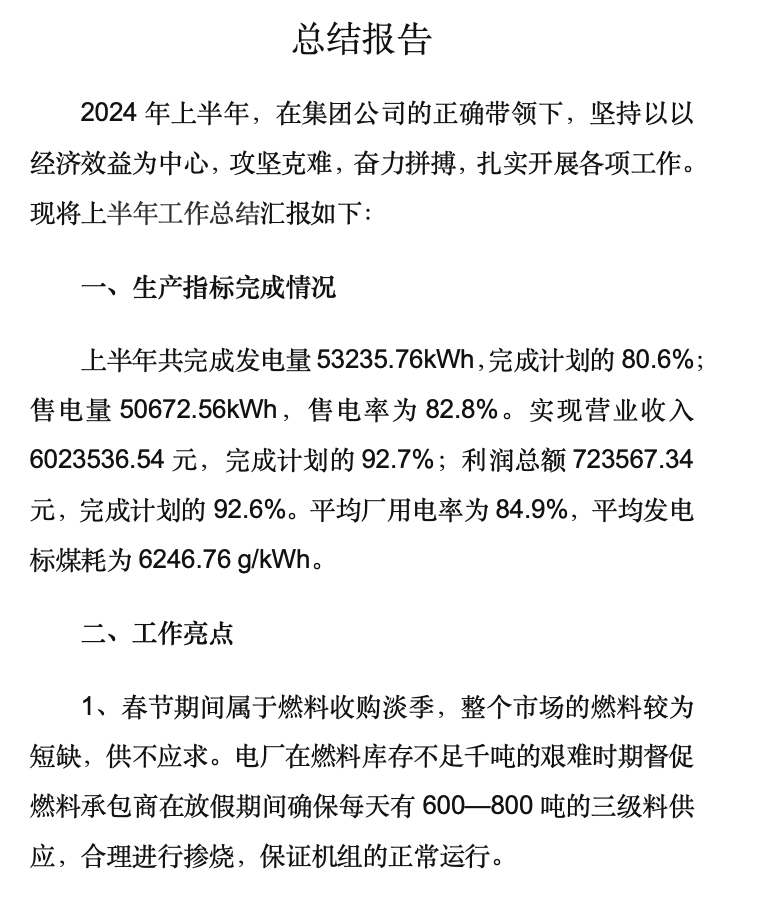

<h4 align="right"><strong>English</strong> | <a href="./README_zh.md">简体中文</a></h4>

<p align="center">
   
   
   
</p> 

# Wang-Template: A Simple Report Render Platform

## Introduction

This system is a report rendering module extracted from the actual production platform, as a stand-alone report generation system.

This system is BS architecture, this project is a back-end service, front-end project address.

## Features

1. Lightweight

```
This system only focuses on report generation, which can interface with any data source and generate corresponding reports through customized templates.
```

2. Extensible

```
The system adopts a modular architecture and an interface-oriented design, which makes it easy to quickly extend other data sources and rendering methods.
```

3. Easy Integration

```
Easily integrated into other systems as a module for report generation functions.
```

4. More Intelligent

```
Integration of AIGC services provides smarter report generation capabilities.
```

## Core Tech Stack

| Tech        | Version |
|-------------|---------|
| Java        | 8+      |
| Spring      | 5.3.31  |
| Spring Boot | 2.7.18  |

### Supported data source types

- Relational database SQL: supports querying data from relational databases, and data querying is realized through JDBC interface. Among them, MySQL, Postgresql and H2 have been verified and tested.

### Supported report types

- Word Report: Use [poi-tl](https://deepoove.com/poi-tl/) to support Word templates to generate Word reports.
- Text Report: Use [FreeMarker](https://freemarker.apache.org/) to support arbitrary text reports, generating text reports, such as TXT, Markdown, HTML and so on.

## Structures

```
WangTemplateBackend
|-- app  -- Report rendering module
|-- design  -- Database design files
|-- framework  -- Framework module
|-- report  -- Unit tests aggregation report
|-- system  -- System management module
|-- task  -- Task management module
```

## Snapshots

### Configure Datasource



### Configure Datasource Parameters



### Datasource Detail



### Test to retrieve data



### Configure Template



The template file is shown below



### Create generation task (select data source, template, enter parameters)



### View Results



The report generated is shown below



## Configuration File Description

### Configuration File

Add configuration file `application-prod.yml` or `application-prod.properties`, can refer to `app/src/main/resources/example-application-dev.yml`.

### Configure Database

Configure under `spring.datasource.druid` or `mybatis-flex.datasource.master`.

Example:

```yaml
spring:
  flyway:
    # Enable flyway to migrate
    enabled: true
    # Note to change to the corresponding database directory
    # If there is no corresponding database, you can use PDManer to generate a database with design files.
    locations:
      - classpath:db/migration/mysql

mybatis-flex:
  # configure datasource
  datasource:
    # master datasource
    master:
      url: jdbc:mysql://localhost:3306/wb-template-dev?useUnicode=true&characterEncoding=utf8&zeroDateTimeBehavior=convertToNull&useSSL=true&serverTimezone=GMT%2B8
      username: root
      password: 123456
      # The following Druid parameters can be configured according to actual requirements
      # Initial connection pool size
      initial-size: 5
      # max active connection pool size
      max-active: 20
      # min connection pool size
      min-idle: 5
```

Supported databases for service (the following databases have been tested):

- MySQL 8
- MySQL 5 (Since Flyway doesn't support it, it needs to be executed manually for migration in `db.migration/mysql` and disable flyway)
- Postgresql
- H2

### Configure Attachment Storage

It depends on [x-file-storage](https://x-file-storage.xuyanwu.cn/#/), support local files, MinIO and cloud service storage, please refer to the official documentation.

Example

```yaml
dromara:
  x-file-storage: # Storage configuration
    default-platform: local-plus-1 # default platform
    thumbnail-suffix: ".min.jpg" # thumbnail
    # storage platform configuration
    local-plus:
      - platform: local-plus-1 # name
        enable-storage: true  # enabled
        enable-access: true # enable access
        domain: http://127.0.0.1:8080/file/ # domain
        base-path: local-plus/ # base path
        path-patterns: /file/** # access path
        storage-path: ./data # storage directory
```

### Configure Report Analysis (AI)

```yaml
analysis:
  # enable indicator analysis
  indicatorAnalysis: true
  # use kimi cloud service, please use  Kimi API access key, refer to https://platform.moonshot.cn/docs/intro#%E4%BD%BF%E7%94%A8%E6%8C%87%E5%8D%97
  moonShot:
    accessToken:
```

## Template Introduction

### Template Context Data

All templates are injected with a rendered context object, which has the following format:
```json5
{
  "templateName": "",  // template name
  "datasourceName": "",  // datasource name
  "params": {},  // render parameters
  "envs": {  // environments
    "year": 2024,  // year
    "month": 6,  // month
    "day": 12,  // day
    "dayOfWeek": 3,  // day of week
    "hour": 0,  // hour
    "minute": 0,  // minute
    "second": 0  // second
  },
  "data": {}  // data obtained from a data source, which may be an array or an object
}
```

To use it in the template like this: `${envs.year}`。

### Word Template

Word template depends on [poi-tl](https://deepoove.com/poi-tl/) , the syntax can be found in the official documentation. The variables use `${name}` style。

### Text Template

Text template depends on [FreeMarker](https://freemarker.apache.org/) , the syntax tan be found in the official documentation.

## Follow-up Plan

- Support for more data sources
- Adding timed tasks and generating schedules
- Integrate more AI capabilities
