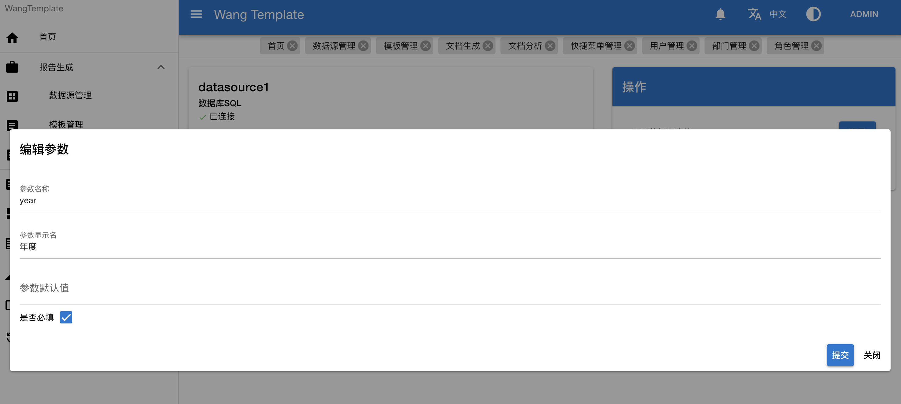
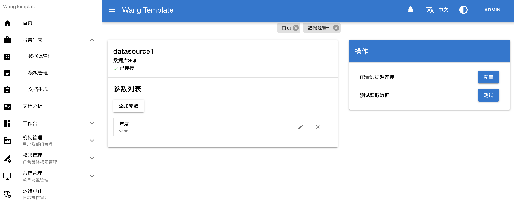
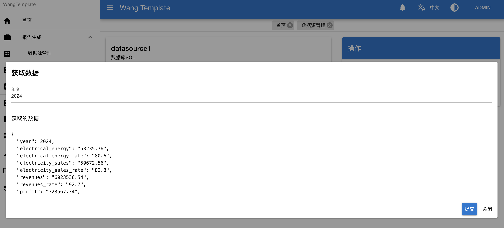
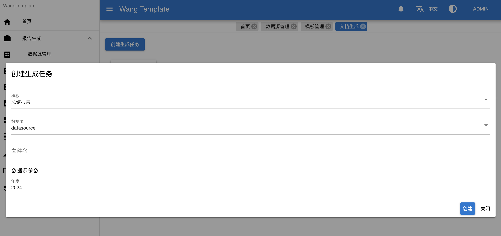

<h4 align="right"><a href="./README.md">English</a> | <strong>简体中文</strong></h4>

<p align="center">
   
   
   
</p> 

# Wang-Template: 简洁易用的报告生成系统

## 描述

本系统是从实际生产平台中抽离出来的报告渲染模块，作为了一款独立的报告生成系统。

本系统是前后端分离的架构，此项目是后端服务，前端项目地址。

## 特点

1. 轻量化

```
本系统只关注报告生成，可以对接任意的数据源，通过自定义的模版，生成对应的报告。
```

2. 可扩展

```
本系统采用了模块化的架构，面向接口的设计，易于快速扩展其他的数据源和渲染方式。
```

3. 易整合

```
易于整合到其他系统中，作为报告生成功能的模块。
```

4. 更智能

```
整合了大文本人工智能服务，可提供更智能化的报告生成能力。
```

## 核心技术栈

| 技术栈 | 版本 |
| ----- | ---- |
| Java | 8+ |
| Spring | 5.3.31 |
| Spring Boot | 2.7.18 |

### 支持的数据源类型

- 关系型数据库 SQL：支持从关系型数据库查询数据，通过 JDBC 接口实现数据查询。其中 MySQL、Postgresql 和 H2 已验证测试。

### 支持的报告类型

- Word报告：使用 [poi-tl](https://deepoove.com/poi-tl/) 支持Word模版的编辑，生成Word报告。
- 文本报告：使用 [FreeMarker](https://freemarker.apache.org/) 支持任意文本报告的编辑，生成文本报告，如 TXT、Markdown、HTML等。

## 工程结构

```
WangTemplateBackend
|-- app  -- 报告渲染模块
|-- design  -- 数据库设计文件
|-- framework  -- 框架模块
|-- report  -- 单元测试聚合报告
|-- system  -- 系统管理模块
|-- task  -- 任务模块
```

## 系统截图

### 配置数据源


### 配置数据源参数



### 数据源详情



### 测试获取数据



### 配置模版


模版文件如下所示


### 创建生成任务(选择数据源、模版，输入参数)



### 查看结果


生成的报告如下所示


## 配置说明

### 配置文件

添加配置文件 `application-prod.yml` 或 `application-prod.properties`，可参考 `app/src/main/resources/example-application-dev.yml` 文件。

### 配置数据库

在 `spring.datasource.druid` 项下配置或在 `mybatis-flex.datasource.master` 下配置。

例如

```yaml
spring:
  flyway:
    # 启用 flyway 自动数据库创建
    enabled: true
    # 注意修改为对应数据库目录
    # 如果没有对应的数据库，可根据 design 中的 PDManer 使用用 PDManer 生成
    locations:
      - classpath:db/migration/mysql

mybatis-flex:
  # 数据源配置
  datasource:
    # 主库数据源
    master:
      url: jdbc:mysql://localhost:3306/wb-template-dev?useUnicode=true&characterEncoding=utf8&zeroDateTimeBehavior=convertToNull&useSSL=true&serverTimezone=GMT%2B8
      username: root
      password: 123456
      # 以下为 Druid 参数，可根据实际需求配置
      # 初始连接数
      initial-size: 5
      # 最大连接池数量
      max-active: 20
      # 最小连接池数量
      min-idle: 5
```

服务部署的数据库（已测试如下数据库）：

- MySQL 8
- MySQL 5（由于Flyway不支持，需要手动执行 `db.migration/mysql` 中的数据库脚本创建，并关闭 flyway 自动数据库迁移）
- Postgresql
- H2

### 配置附件存储

附件存储基于 [x-file-storage](https://x-file-storage.xuyanwu.cn/#/)，支持本地存储，MinIO，公有云对象存储等，具体配置可参考官方文档。

例如

```yaml
dromara:
  x-file-storage: # 文件存储配置
    default-platform: local-plus-1 # 默认使用的存储平台
    thumbnail-suffix: ".min.jpg" # 缩略图后缀，例如【.min.jpg】【.png】
    # 对应平台的配置写在这里，注意缩进要对齐
    local-plus:
      - platform: local-plus-1 # 存储平台标识
        enable-storage: true  # 启用存储
        enable-access: true # 启用访问（线上请使用 Nginx 配置，效率更高）
        domain: http://127.0.0.1:8080/file/ # 访问域名，例如：“http://127.0.0.1:8030/file/”，注意后面要和 path-patterns 保持一致，“/”结尾，本地存储建议使用相对路径，方便后期更换域名
        base-path: local-plus/ # 基础路径
        path-patterns: /file/** # 访问路径
        storage-path: ./data # 存储路径
```

### 配置报告分析（人工智能）

```yaml
analysis:
  # 启用报告指标分析
  indicatorAnalysis: true
  # 使用 Kimi 大模型，请填入 Kimi API 密钥，参考 https://platform.moonshot.cn/docs/intro#%E4%BD%BF%E7%94%A8%E6%8C%87%E5%8D%97
  moonShot:
    accessToken:
```

## 模版说明

### 模版上下文对象

所有的模版都注入了渲染的上下文对象，对象格式如下：
```json5
{
  "templateName": "",  // 模版名称
  "datasourceName": "",  // 数据源名称
  "params": {},  // 渲染参数
  "envs": {  // 环境变量
    "year": 2024,  // 当前年
    "month": 6,  // 当前月
    "day": 12,  // 当前日
    "dayOfWeek": 3,  // 当前星期
    "hour": 0,  // 当前时
    "minute": 0,  // 当前分
    "second": 0  // 当前秒
  },
  "data": {}  // 从数据源获取的数据，可能是数组或对象
}
```

如在模版中获取当前年可用变量：`${envs.year}`。

### Word模版

Word 模板基于 [poi-tl](https://deepoove.com/poi-tl/) ，模版语法可参考官方文档。本项目的变量使用了 `${name}` 的形式。

### 文本模版

文本模版基于 [FreeMarker](https://freemarker.apache.org/) ，模板语法可参考官方文档。

## 后续计划

- 支持更多数据源
- 增加定时任务和生成计划
- 集成更多人工智能能力
